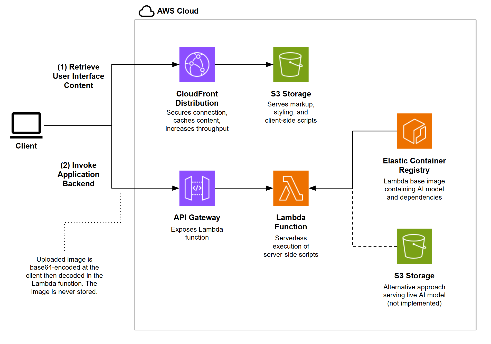

# Rice Classifier
A machine learning model trained to classify images of grains of rice, hosted at https://yahianassab.com/riceclassifier.

The rice image dataset was provided by Kaggle user MURAT KOKLU under a CC0 Public Domain license. https://www.kaggle.com/datasets/muratkokludataset/rice-image-dataset.

In the featured notebook, the dataset is downloaded directly from the dataset contributor's website. Details of this and other datasets can be found here: https://www.muratkoklu.com/datasets/.

The TensorFlow and Pillow wheels used in this project can be downloaded from PyPI at https://pypi.org/project/tensorflow/2.9.2/#files and https://pypi.org/project/pillow/10.1.0/#files respectively.

## Model Design
The model architecture is a conventional **Convolutional Neural Network (CNN)** with two pairs of stacked image convolution layers and max-pooling layers, the output of which is flattened and passed to two fully connected layers (including the output layer).

### Training Design
To avoid overfitting during training, the following features were implemented:

1. **Data augmentation**: Each training image is randomly flipped and rotated before being passed to the model as input.
2. **L2 regularization**: The hidden fully connected layer incurs a loss penalty when updating its weights. This promotes weight updates that are transferable between images, instead of being applicable to only one image.
3. **Dropout**: 20% of the weights of the hidden layer are set to zero before being passed to the output layer, promoting weights that are recurring and persistent between training steps.

With the above features, the model classifies data it has not seen before with an accuracy of 98.0%.

### Further Improvement
The high validation accuracy is aided by the consistency of the training dataset, constituting monochrome objects of interest centred and set against a solid black background with minimal variability. For more variable datasets, transfer learning may be applied, in which the model is built upon the foundation of another pre-trained model. An example base model that could be used would be the latest in the `efficientnet` class published by [Google Research](https://www.kaggle.com/models?tfhub-redirect=true&query=efficientnet).

## Web Application

### Serverless Architecture
AWS Lambda is used for model inference to maintain low-cost resource allocation given that the application is not projected to see sufficient usage for a persistent server. Similar design choices are applied here as in the [Abstract Generator](https://github.com/ynassab/abstractgenerator) project.

### Image Encoding Strategy

Rather than upload the image to an S3 bucket to then be processed by the Lambda function, the design was simplified by instead **transmitting the image as a base64-encoded string** directly to the Lambda function via REST API. This eliminates the need for data storage and handling outside of the context of the Lambda function. It also facilitates debugging and reduces the attack surface by ensuring text-based, pre-validated payloads are sent to the backend. Although it increases payload size, this trade-off is manageable given the typical size of images being processed and supports efficient, secure, and straightforward integration between the client and server.

